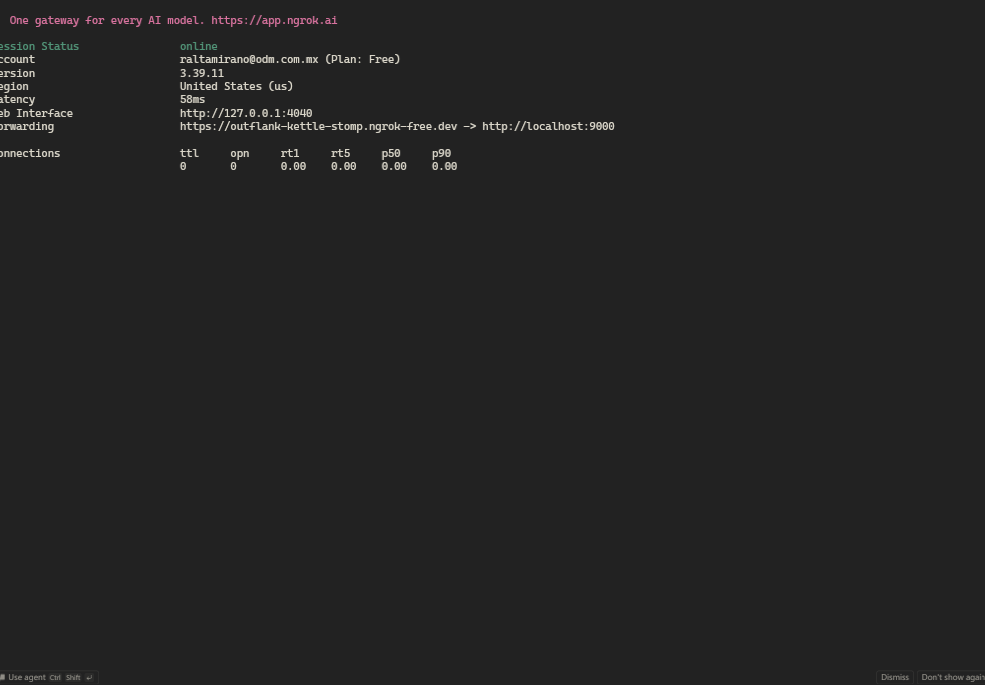
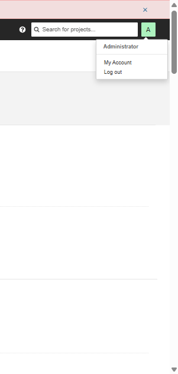
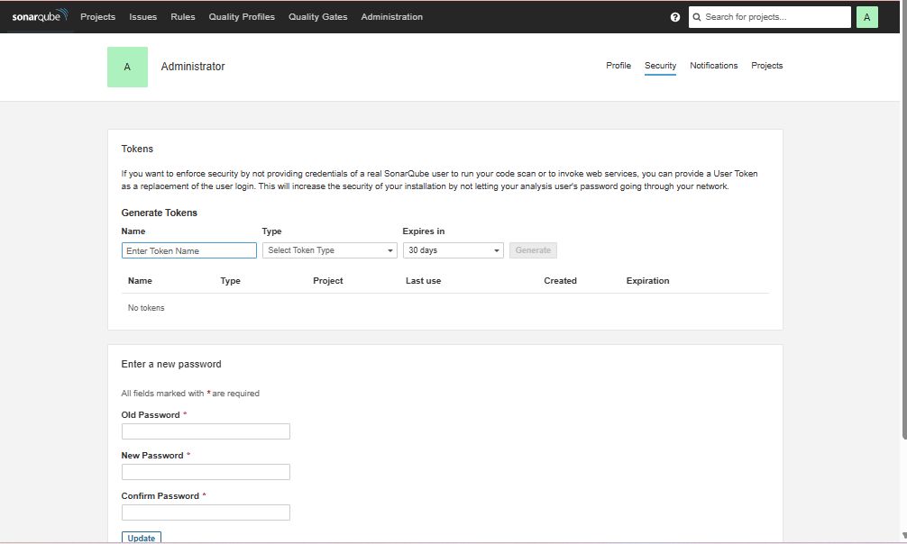
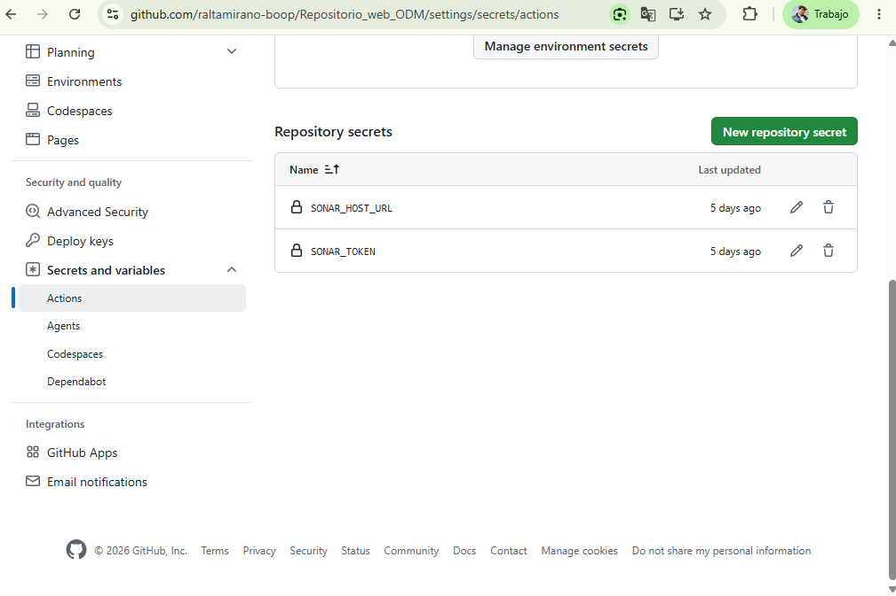
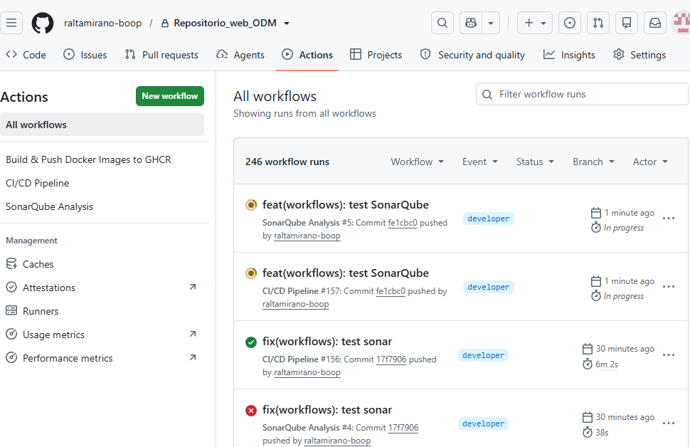

# 🛡️ SonarQube - Plataforma de Calidad y Seguridad Continua

Este repositorio contiene la configuración local mediante **Docker Compose** para desplegar una instancia de **SonarQube** (Community Edition), su base de datos en PostgreSQL, y los pasos necesarios para conectarlo a un flujo CI/CD (GitHub Actions).

Además, se incluye una **Presentación Ejecutiva** interactiva lista para usarse con directivos (archivo HTML).

---

## 📋 Requisitos Previos

1. **Docker Desktop** instalado y corriendo en tu máquina.
2. Opcional: **Ngrok** (si deseas exponer tu instancia local a la nube de manera temporal para que GitHub Actions pueda acceder a ella).

---

## 🚀 Instalación y Arranque Rápido

1. Abre una terminal en esta carpeta.
2. Levanta los servicios ejecutando:
   ```bash
   docker-compose up -d
   ```
3. Espera un par de minutos a que el servidor de SonarQube termine de inicializar.
4. Accede al panel de SonarQube desde tu navegador en:
   👉 **http://localhost:9000**

### Credenciales por defecto:
- **Usuario:** `admin`
- **Contraseña:** `admin`
*(El sistema te pedirá cambiar la contraseña en el primer inicio de sesión).*

---

## 🗄️ Estructura de Servicios (Docker Compose)

El archivo `docker-compose.yml` despliega dos contenedores orquestados:

- `sonarqube_prueba`: Servidor principal de análisis (Puerto 9000).
- `postgres_sonar`: Base de datos PostgreSQL v15 para almacenar los análisis, usuarios y reglas (Puerto 5432 expuesto internamente).

> **Nota de persistencia:** Se creó un volumen llamado `sonar_db_data` para evitar la pérdida de los análisis e historial cuando se apague el contenedor.

---

## ☁️ Exposición Local hacia GitHub Actions (Uso de Ngrok)

**¿Por qué usamos ngrok?**
GitHub Actions se ejecuta en la nube, por lo que necesita comunicarse con tu SonarQube para enviarle el código que debe analizar. Como tu SonarQube está corriendo en tu computadora local (`localhost`), GitHub no tiene forma de "verlo". **Ngrok** resuelve esto creando un túnel seguro y generando una URL pública temporal que conecta directamente a tu puerto local.

**¿Cómo instalarlo?**
1. Descarga el ejecutable desde [ngrok.com/download](https://ngrok.com/download).
2. Descomprime el archivo e inicia sesión en su página para obtener tu token de autenticación gratuito.
3. Configura tu token en tu terminal ejecutando: `ngrok config add-authtoken <tu-token>`

Una vez instalado, expón el puerto `9000` ejecutando:

```bash
ngrok http 9000
```
Copia el enlace `https://xxxx.ngrok-free.app` que te arroje la consola; este será tu `SONAR_HOST_URL` para GitHub.



---

## 🔗 Integración con GitHub Actions (CI/CD)

Para que tus repositorios analicen el código automáticamente en cada commit:

1. **Generar Token en SonarQube:**
   - Ve a `My Account > Security`.
   - Genera un nuevo Token de tipo `User Token` (o `Global Analysis Token`). Cópialo.
   
   
   

2. **Configurar Secrets en GitHub:**
   En tu repositorio de código en GitHub, ve a `Settings > Secrets and variables > Actions` y crea:
   - `SONAR_TOKEN`: Pega aquí el token generado en SonarQube.
   - `SONAR_HOST_URL`: Pega la URL de ngrok (ej. `https://xxxx.ngrok-free.app`).

   

3. **Ejemplo básico de Workflow (`.github/workflows/build.yml`):**

```yaml
name: SonarQube Scan
on:
  push:
    branches:
      - main
jobs:
  build:
    name: Analizar Código
    runs-on: ubuntu-latest
    steps:
      - uses: actions/checkout@v3
        with:
          fetch-depth: 0  # SonarQube necesita todo el historial
      - name: SonarQube Scan
        uses: SonarSource/sonarqube-scan-action@master
        env:
          SONAR_TOKEN: ${{ secrets.SONAR_TOKEN }}
          SONAR_HOST_URL: ${{ secrets.SONAR_HOST_URL }}
```

**Resultado en GitHub Actions (Ejecución Exitosa):**



---

## 📊 Presentación Ejecutiva (Para Directivos)

Para facilitar la comunicación con Gerencia y Dirección, hemos desplegado una **Presentación Interactiva** que explica estratégicamente el valor de esta implementación.

🌐 **Ver Presentación en Línea:** [https://raltamirano-boop.github.io/SonarQube/](https://raltamirano-boop.github.io/SonarQube/)

**Contenido de la Presentación:**
- Disminución de deuda técnica y seguridad desde el diseño.
- Retorno de Inversión (ROI) para el equipo y el negocio.
- Explicación visual del flujo de calidad (Quality Gate).
- Radiografía actual del sistema con métricas y capturas reales.

> **Nota:** El código fuente de esta presentación se encuentra en el archivo `index.html` de este repositorio.

---
*Mantenimiento: ODM (Infraestructura y Calidad de Código)*
